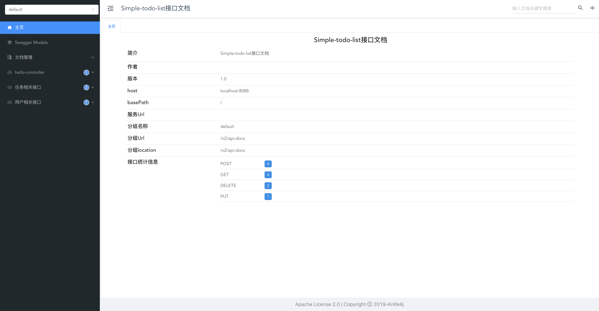
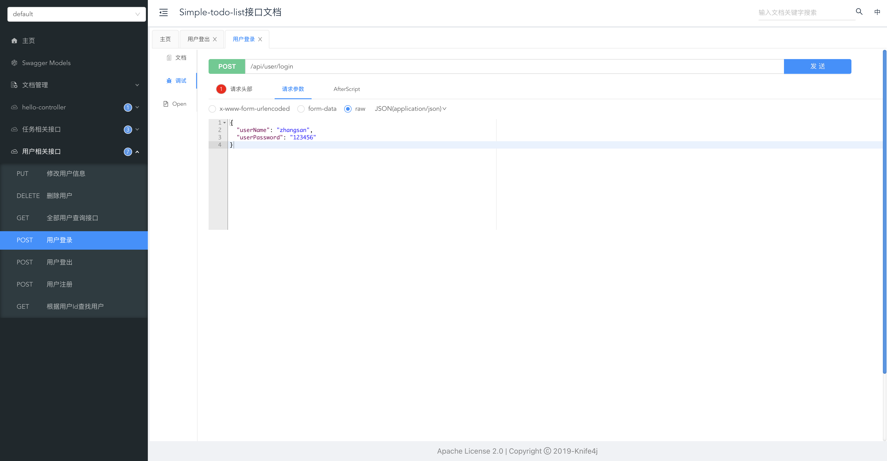
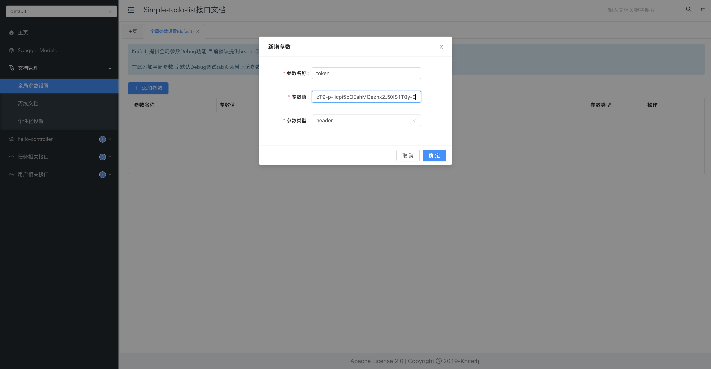
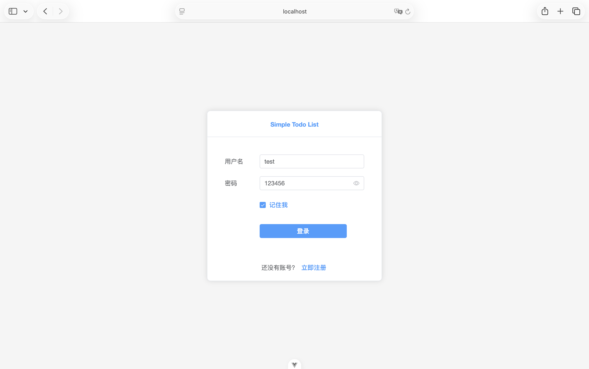
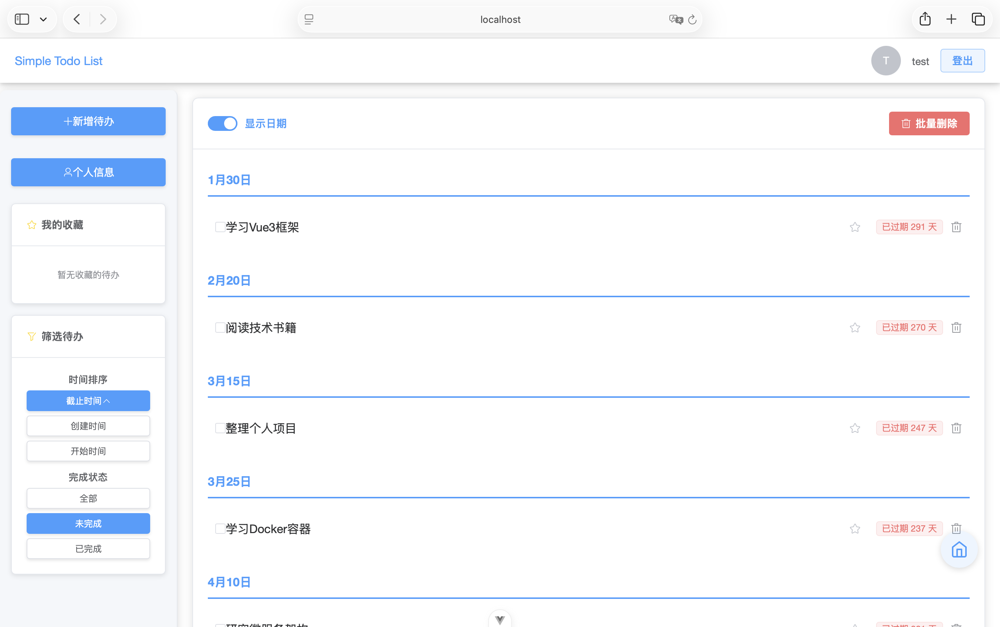

<div align="center">

### Simple Todo List

</div>

---

### 目录

- [项目结构](#项目结构)
- [技术栈](#技术栈)
  - [后端](#后端)
  - [前端](#前端)
  - [开发环境](#开发环境)
- [核心功能](#核心功能)
  - [用户管理](#用户管理)
  - [待办事项管理](#待办事项管理)
  - [界面交互](#界面交互)
- [快速开始](#快速开始)
  - [启动项目](#启动项目)
    - [方式一：使用 Docker Compose 启动](#方式一使用-docker-compose-启动)
    - [方式二：分别启动各组件](#方式二分别启动各组件)
  - [后端接口调试方法](#后端接口调试方法)
- [界面展示](#界面展示)
- [未来计划](#未来计划)

---

# <span id="项目结构">项目结构</span>

```
simple-todo-list/                  # 项目根目录
├── back-end/                      # 后端项目
│   ├── src/main/java/             # 后端源码
│   │   └── org/star5025/backend/  # 后端主包
│   │       ├── BackEndApplication.java  # 启动类
│   │       ├── config/            # 配置类
│   │       ├── context/           # 上下文
│   │       ├── controller/        # 控制器
│   │       ├── dto/               # 数据传输对象
│   │       ├── entity/            # 实体类
│   │       ├── enumeration/       # 枚举类
│   │       ├── exception/         # 异常处理
│   │       ├── interceptor/       # 拦截器
│   │       ├── mapper/            # Mapper接口
│   │       ├── properties/        # 属性配置
│   │       ├── result/            # 结果封装
│   │       ├── service/           # 业务逻辑
│   │       ├── utils/             # 工具类
│   │       └── vo/                # 视图对象
│   └── src/main/resources/        # 资源配置
│       ├── db/                    # 数据库脚本
│       └── application.yml        # 主配置文件
├── front-end/                     # 前端项目
│   ├── src/                       # 前端源码
│   │   ├── App.vue                # 根组件
│   │   ├── main.js                # 入口文件
│   │   ├── components/            # 公共组件
│   │   ├── router/                # 路由配置
│   │   ├── stores/                # 状态管理
│   │   ├── utils/                 # 工具类
│   │   └── views/                 # 页面视图
│   ├── package.json               # 依赖配置
│   └── vite.config.js             # 构建配置
├── docker-compose.yml             # Docker编排配置
└── docs/                          # 文档资源
```

项目采用前后端分离架构，后端基于Spring Boot框架，前端基于Vue 3框架。

---

# <span id="技术栈">技术栈</span>

本项目采用了前后端分离的架构模式，以下是详细的技术栈信息：

## 后端

| 技术 | 版本范围 | 说明 |
| ---- | ---- | ---- |
| [Spring Boot](https://spring.io/projects/spring-boot) | 2.7.x | Java Web开发框架 |
| [Spring Web](https://docs.spring.io/spring-framework/docs/current/reference/html/web.html) | 2.7.x | Web应用框架 |
| [MyBatis-Plus](https://baomidou.com/) | 3.5.x | 数据库访问框架 |
| [MySQL](https://www.mysql.com/) | 8.0.x | 关系型数据库 |
| [Knife4j](https://doc.xiaominfo.com/) | 3.0.x | Swagger文档增强工具 |
| [JWT](https://jwt.io/) | 0.9.x | JSON Web Token实现 |
## 前端

| 技术 | 版本范围 | 说明 |
| ---- | ---- | ---- |
| [Vue.js](https://vuejs.org/) | 3.5.x | 前端渐进式框架 |
| [Element Plus](https://element-plus.org/) | 2.11.x | Vue 3 UI组件库 |
| [Vue Router](https://router.vuejs.org/) | 4.5.x | Vue.js路由管理器 |
| [Axios](https://axios-http.com/) | 1.13.x | HTTP客户端 |
| [Vite](https://vitejs.dev/) | 7.1.x | 前端构建工具 |

## 开发环境

| 工具 | 版本要求 | 用途 |
| ---- | ---- | ---- |
| [Node.js](https://nodejs.org/) | ^20.19.0 \|\| >=22.12.0 | JavaScript运行环境 |
| [Maven](https://maven.apache.org/) | 3.8.x | Java项目管理工具 |
| [Java](https://www.oracle.com/java/) | 17 | 后端开发语言 |

---

# <span id="核心功能">核心功能</span>

## 用户管理

- 用户注册与登录
- JWT Token身份验证
- 用户信息查看与修改

## 待办事项管理

- 添加待办事项（支持设置名称、描述、开始时间、截止时间、提醒时间等）
- 查看待办事项列表（支持分页和筛选）
- 查看待办事项详情
- 编辑待办事项
- 删除单个或批量删除待办事项

## 界面交互

- 响应式设计，适配不同屏幕尺寸
- 键盘快捷键支持（ESC返回、Enter确认等）
- 实时状态反馈和提示信息

---

# <span id="快速开始">快速开始</span>

## <span id="启动项目">启动项目</span>

### 方式一：使用 Docker Compose 启动

项目使用 Docker Compose 统一管理 MySQL、后端和前端服务，可以通过一条命令启动整个应用：

```bash
# 克隆项目到本地
git clone https://github.com/star5025/simple-todo-list
cd simple-todo-list

# 使用 docker-compose 启动所有服务
docker-compose up
```

启动后，可以通过以下地址访问：

- 前端界面：http://localhost:5173
- 后端接口文档：http://localhost:8088/doc.html
- 数据库：localhost:3306

> ⚠️ 注意：如果需要修改数据库用户名和密码，请同时修改以下文件：
> 1. **docker-compose.yml** 中的 `MYSQL_ROOT_PASSWORD` 和相关环境变量
> 2. 确保后端配置与数据库配置保持一致

### 方式二：分别启动各组件

1. **启动数据库**

确保本地已安装 MySQL 8.0，并创建数据库：

```sql
CREATE DATABASE simple_todo_list CHARACTER SET utf8mb4 COLLATE utf8mb4_unicode_ci;
```

执行数据库初始化脚本：

```bash
# 进入数据库脚本目录
cd back-end/src/main/resources/db

# 执行SQL脚本
mysql -u root -p simple_todo_list < init.sql
```

> ⚠️ 注意：请根据实际的数据库用户名和密码修改连接信息。默认用户名为 root，密码为 12345678。

2. **启动后端服务**

```bash
# 进入后端目录
cd back-end

# 使用 Maven Wrapper 启动后端服务
./mvnw spring-boot:run
```

默认情况下，后端服务将运行在 http://localhost:8088

> ⚠️ 注意：后端服务的数据库连接配置在 **application.yml** 文件中，请根据实际情况修改数据库连接信息。

1. **启动前端服务**

```bash
# 进入前端目录
cd front-end

# 安装依赖
npm install

# 启动前端开发服务器
npm run dev
```

默认情况下，前端服务将运行在 http://localhost:5173

## <span id="后端接口调试方法">后端接口调试方法</span>

> 1. 启动后端后，使用浏览器访问 **localhost:后端运行端口/doc.html** 以查看接口文档。 (由 **knife4j-spring-boot-starter** 依赖提供)
> 
>
> 2. 在 **用户相关接口** 中选择 **用户登录** 接口。选择左侧边栏的 **调试** 功能，在json格式请求参数中填写对应的数据。
> 
>
> 3. 点击发送后，可以看到后端 **响应内容** 中含有 **token** 字段，复制该字段的值。然后在 **文档管理** 中选择 **全局参数设置**， 点击 **添加参数**， 设置参数名称为 **token**， 设置参数值为复制的字段值。
> 
>
> 4. 上述操作完成后，即可调试其他接口，调试方法与 **步骤2** 相似，传入的数据由方法决定。🎉

<br>

> 注: *以上将已注册的用户名和密码发送给后端以获取token的操作实际上是用户登录操作。用户成功登录后，后端会生成用于用户校验的token。每次调用后端方法时，都需要将token传给后端进行校验。这样，未登录的用户就无法调用的后端接口了。*

---

# <span id="界面展示">界面展示</span>

**登录与注册界面**


**主页**


---

# <span id="未来计划">未来计划</span>

- [ ] 前端外观美化
- [ ] 前端响应式设计，支持移动端
- [ ] 用户数据看板功能
- [ ] 用户交互功能
- [ ] 项目网站部署并上线