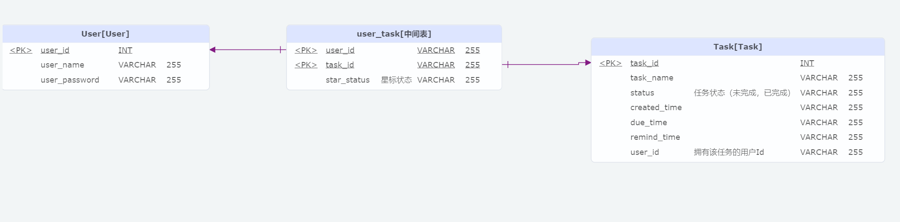

# 正在开发中... 🛠️

-----

## 核心功能🔥:
> 1. 用户注册与登录
> 2. 对计划增删改查操作

-----

## 技术栈🛠️:
> 前端: Vue.js / Axios / Element Plus  
> 后端: Spring Boot / Spring Web  
> 数据库: MySQL

-----

## 设计💡:

> #### 用例图
> 

> #### UI图
> 

> #### ER图
> 

#### 流程图

-----

## 后端接口调试方法

> 1. 启动后端后，使用浏览器访问 **localhost:后端运行端口/doc.html** 以查看接口文档。 (由 **knife4j-spring-boot-starter** 依赖提供)
> 
> 2. 在 **用户相关接口** 中选择 **用户登录** 接口。选择左侧边栏的 **调试** 功能，在json格式请求参数中填写对应的数据。
> 
> 3. 点击发送后，可以看到后端 **响应内容** 中含有 **token** 字段，复制该字段的值。然后在 **文档管理** 中选择 **全局参数设置**， 点击 **添加参数**， 设置参数名称为 **token**， 设置参数值为复制的字段值。
> 
> 4. 上述操作完成后，即可调试其他接口，调试方法与 **步骤2** 相似，传入的数据由方法决定。🎉

> 注: *以上将已注册的用户名和密码发送给后端以获取token的操作实际上是用户登录操作。用户成功登录后，后端会生成用于用户校验的token。每次调用后端方法时，都需要将token传给后端进行校验。这样，未登录的用户就无法调用的后端接口了。*