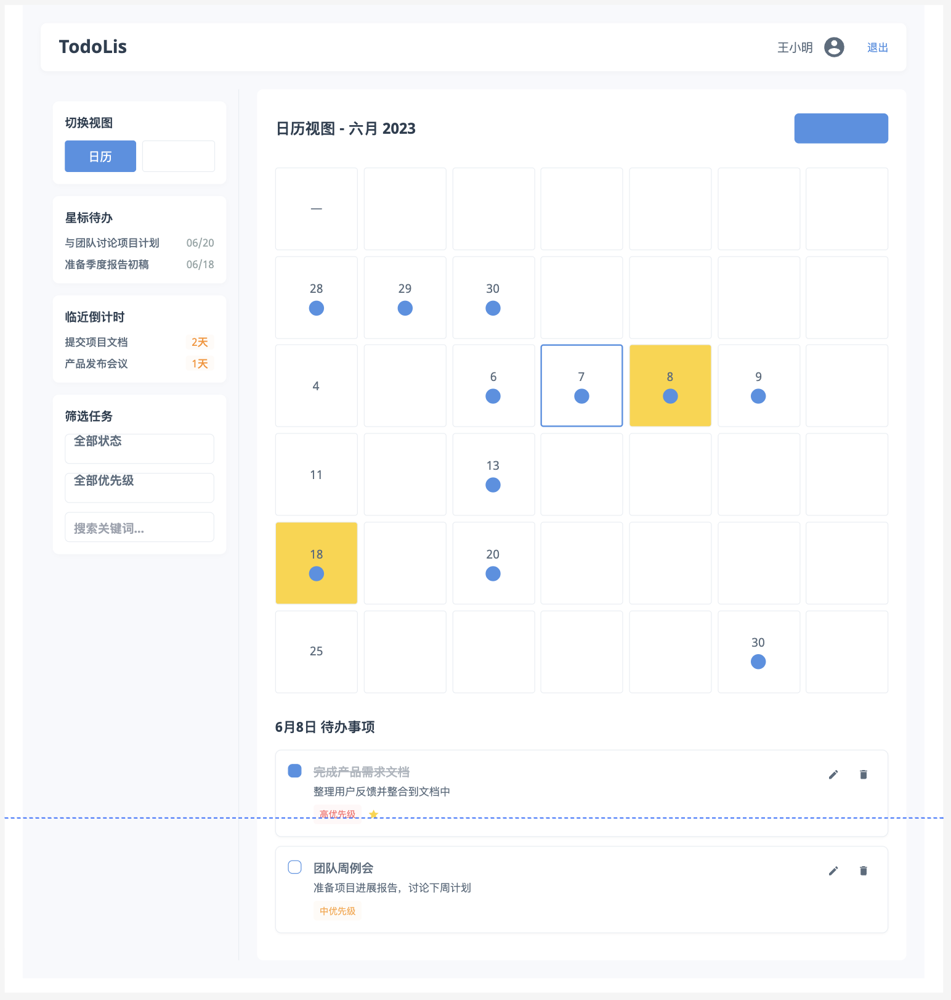

# 正在开发中... 🛠️

## 核心功能
> 1. 用户注册与登录
> 2. 对计划增删改查操作

## 技术栈:
> 前端: Vue.js / Axios / Element Plus  
> 后端: Spring Boot / Spring Web  
> 数据库: MySQL

## 设计

> #### 用例图
> 

> #### UI图
> 

#### ER图

#### 流程图
