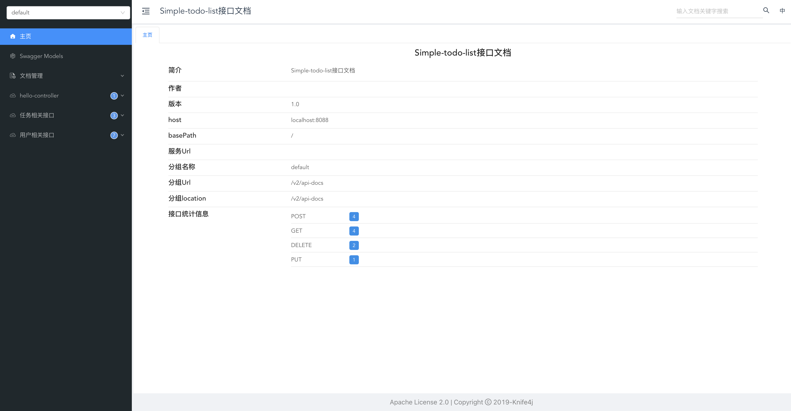
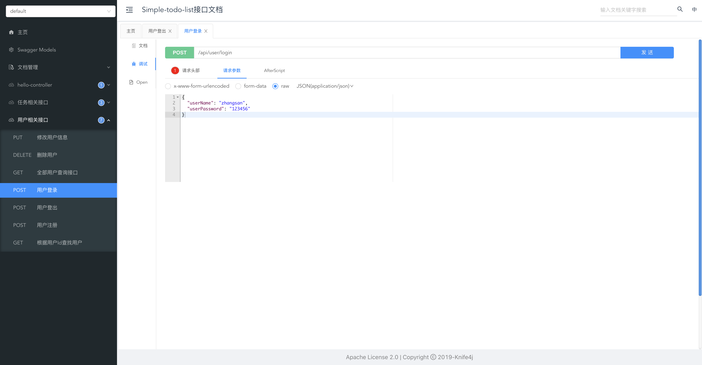
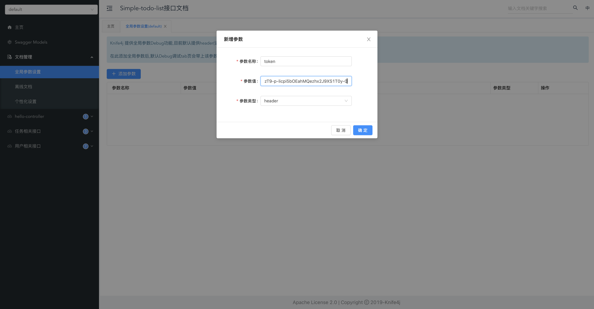
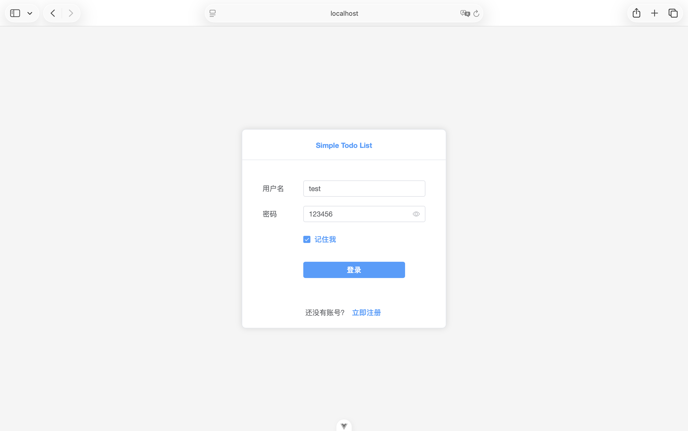
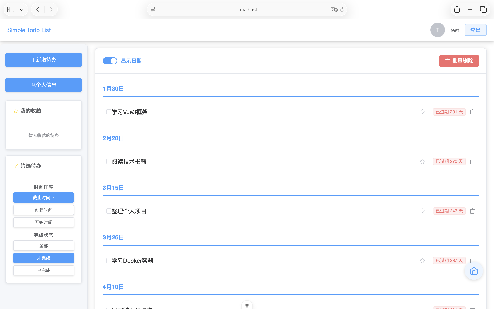

<div align="center">

### Simple Todo List

</div>

---

### Table of Contents

- [Project Structure](#project-structure)
- [Technology Stack](#technology-stack)
  - [Backend](#backend)
  - [Frontend](#frontend)
  - [Development Environment](#development-environment)
- [Core Features](#core-features)
  - [User Management](#user-management)
  - [Todo Management](#todo-management)
  - [Interface Interaction](#interface-interaction)
- [Quick Start](#quick-start)
  - [Starting the Project](#starting-the-project)
    - [Method 1: Using Docker Compose](#method-1-using-docker-compose-to-start)
    - [Method 2: Starting Components Separately](#method-2-starting-components-separately)
  - [Backend API Debugging Method](#backend-api-debugging-method)
- [Interface Showcase](#interface-showcase)
- [Future Plans](#future-plans)

---

# <span id="project-structure">Project Structure</span>

```
simple-todo-list/                  # Project root directory
├── back-end/                      # Backend project
│   ├── src/main/java/             # Backend source code
│   │   └── org/star5025/backend/  # Backend main package
│   │       ├── BackEndApplication.java  # Startup class
│   │       ├── config/            # Configuration classes
│   │       ├── context/           # Context
│   │       ├── controller/        # Controllers
│   │       ├── dto/               # Data Transfer Objects
│   │       ├── entity/            # Entity classes
│   │       ├── enumeration/       # Enum classes
│   │       ├── exception/         # Exception handling
│   │       ├── interceptor/       # Interceptors
│   │       ├── mapper/            # Mapper interfaces
│   │       ├── properties/        # Property configurations
│   │       ├── result/            # Result encapsulation
│   │       ├── service/           # Business logic
│   │       ├── utils/             # Utility classes
│   │       └── vo/                # View objects
│   └── src/main/resources/        # Resource configurations
│       ├── db/                    # Database scripts
│       └── application.yml        # Main configuration file
├── front-end/                     # Frontend project
│   ├── src/                       # Frontend source code
│   │   ├── App.vue                # Root component
│   │   ├── main.js                # Entry file
│   │   ├── components/            # Common components
│   │   ├── router/                # Routing configuration
│   │   ├── stores/                # State management
│   │   ├── utils/                 # Utility classes
│   │   └── views/                 # Page views
│   ├── package.json               # Dependency configuration
│   └── vite.config.js             # Build configuration
├── docker-compose.yml             # Docker orchestration configuration
└── docs/                          # Documentation resources
```

The project adopts a front-end and back-end separated architecture, with the backend based on the Spring Boot framework and the frontend based on the Vue 3 framework.

---

# <span id="technology-stack">Technology Stack</span>

This project adopts a front-end and back-end separated architecture. Below are the detailed technology stack information:

## Backend

| Technology | Version Range | Description |
| ---- | ---- | ---- |
| [Spring Boot](https://spring.io/projects/spring-boot) | 2.7.x | Java Web development framework |
| [Spring Web](https://docs.spring.io/spring-framework/docs/current/reference/html/web.html) | 2.7.x | Web application framework |
| [MyBatis-Plus](https://baomidou.com/) | 3.5.x | Database access framework |
| [MySQL](https://www.mysql.com/) | 8.0.x | Relational database |
| [Knife4j](https://doc.xiaominfo.com/) | 3.0.x | Swagger documentation enhancement tool |
| [JWT](https://jwt.io/) | 0.9.x | JSON Web Token implementation |

## Frontend

| Technology | Version Range | Description |
| ---- | ---- | ---- |
| [Vue.js](https://vuejs.org/) | 3.5.x | Frontend progressive framework |
| [Element Plus](https://element-plus.org/) | 2.11.x | Vue 3 UI component library |
| [Vue Router](https://router.vuejs.org/) | 4.5.x | Vue.js router manager |
| [Axios](https://axios-http.com/) | 1.13.x | HTTP client |
| [Vite](https://vitejs.dev/) | 7.1.x | Frontend build tool |

## Development Environment

| Tool | Version Requirement | Purpose |
| ---- | ---- | ---- |
| [Node.js](https://nodejs.org/) | ^20.19.0 \|\| >=22.12.0 | JavaScript runtime environment |
| [Maven](https://maven.apache.org/) | 3.8.x | Java project management tool |
| [Java](https://www.oracle.com/java/) | 17 | Backend development language |

---

# <span id="core-features">Core Features</span>

## User Management

- User registration and login
- JWT Token authentication
- User information viewing and modification

## Todo Management

- Adding todo items (supports setting name, description, start time, deadline, reminder time, etc.)
- Viewing todo list (supports pagination and filtering)
- Viewing todo details
- Editing todo items
- Deleting single or batch deleting todo items

## Interface Interaction

- Responsive design, adapting to different screen sizes
- Keyboard shortcut support (ESC to return, Enter to confirm, etc.)
- Real-time status feedback and prompt messages

---

# <span id="quick-start">Quick Start</span>

## <span id="starting-the-project">Starting the Project</span>

### Method 1: Using Docker Compose to Start

The project uses Docker Compose to manage MySQL, backend and frontend services uniformly, allowing the entire application to be started with a single command:

> ⚠️ **Note: Before using Docker Compose, please ensure that Docker client and Docker Compose tools have been installed.**

```bash
# Clone the project locally
git clone https://github.com/star5025/simple-todo-list
cd simple-todo-list

# Use docker-compose to start all services
docker-compose up
```

After startup, you can access through the following addresses:

- Frontend interface: http://localhost:5173
- Backend API documentation: http://localhost:8088/doc.html
- Database: localhost:3306

> ⚠️ Note: If you need to modify the database username and password, please also modify the following files:
> 1. **docker-compose.yml** for `MYSQL_ROOT_PASSWORD` and related environment variables
> 2. Ensure backend configuration is consistent with database configuration

### Method 2: Starting Components Separately

1. **Starting the Database**

Ensure that MySQL 8.0 is installed locally and create the database:

```sql
CREATE DATABASE simple_todo_list CHARACTER SET utf8mb4 COLLATE utf8mb4_unicode_ci;
```

Execute the database initialization script:

```bash
# Enter the database script directory
cd back-end/src/main/resources/db

# Execute SQL script
mysql -u root -p simple_todo_list < init.sql
```

> ⚠️ Note: Please modify the connection information according to the actual database username and password. Default username is root, password is 12345678.

2. **Starting the Backend Service**

The backend service requires database connection information, which can be configured through environment variables:

```bash
# Enter backend directory
cd back-end

# Use Maven Wrapper to start the backend service (need to set environment variables)
STDL_DATASOURCE_DRIVER_CLASS_NAME=com.mysql.cj.jdbc.Driver \
STDL_DATASOURCE_HOST=localhost \
STDL_DATASOURCE_PORT=3306 \
STDL_DATASOURCE_DATABASE=simple_todo_list \
#your database username
STDL_DATASOURCE_USERNAME=root \ 
#your database password
STDL_DATASOURCE_PASSWORD=12345678 \
./mvnw spring-boot:run
```

```

Alternatively, you can configure the database connection information by modifying the `back-end/src/main/resources/application.yml` file.

By default, the backend service will run at http://localhost:8088

3. **Starting the Frontend Service**

```bash
# Enter frontend directory
cd front-end

# Install dependencies
npm install

# Start the frontend development server
npm run dev
```

By default, the frontend service will run at http://localhost:5173

> 🛠️**System Test Account and Password**: test 123456

## <span id="backend-api-debugging-method">Backend API Debugging Method</span>

> 1. After starting the backend, use the browser to access **localhost:backend-running-port/doc.html** to view the API documentation. (Provided by **knife4j-spring-boot-starter** dependency)
> 

> 2. In the **User Related APIs**, select the **User Login** API. Choose the **Debug** function in the left sidebar, and fill in the corresponding data in the json format request parameters.
> 

> 3. After clicking send, you can see that the backend **response content** contains the **token** field, copy the value of this field. Then in the **Document Management**, select **Global Parameter Settings**, click **Add Parameter**, set the parameter name to **token**, and set the parameter value to the copied field value.
> 

> 4. After the above operations are completed, you can debug other APIs. The debugging method is similar to **Step 2**, and the data to be passed is determined by the method. 🎉

<br>

> Note: *The operation of sending the registered username and password to the backend to obtain a token is actually a user login operation. After the user successfully logs in, the backend generates a token for user verification. Every time a backend method is called, the token needs to be passed to the backend for verification. In this way, unlogged-in users cannot call the backend APIs.*

---

# <span id="interface-showcase">Interface Showcase</span>

**Login and Registration Interface**


**Homepage**


---

# <span id="future-plans">Future Plans</span>

- [ ] Frontend appearance beautification
- [ ] Frontend responsive design, supporting mobile devices
- [ ] User data dashboard functionality
- [ ] User interaction functionality
- [ ] Project website deployment and launch